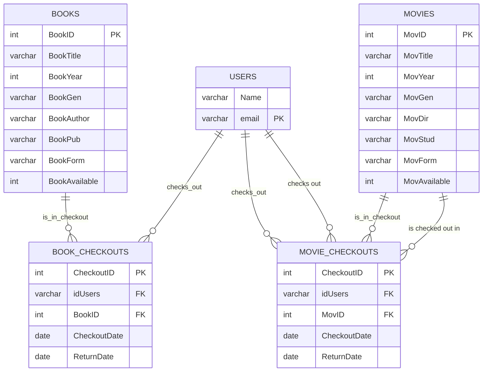

```mermaid
erDiagram
    USERS {
        varchar Name
        varchar email PK
    }

    BOOKS {
        int BookID PK
        varchar BookTitle
        int BookYear
        varchar BookGen
        varchar BookAuthor
        varchar BookPub
        varchar BookForm
        int BookAvailable
    }

    MOVIES {
        int MovID PK
        varchar MovTitle
        int MovYear
        varchar MovGen
        varchar MovDir
        varchar MovStud
        varchar MovForm
        int MovAvailable
    }

    BOOK_CHECKOUTS {
        int CheckoutID PK
        varchar idUsers FK
        int BookID FK
        date CheckoutDate
        date ReturnDate
    }

    MOVIE_CHECKOUTS {
        int CheckoutID PK
        varchar idUsers FK
        int MovID FK
        date CheckoutDate
        date ReturnDate
    }

    USERS ||--o{ BOOK_CHECKOUTS : checks_out
    BOOKS ||--o{ BOOK_CHECKOUTS : is_in_checkout

    USERS ||--o{ MOVIE_CHECKOUTS : checks_out
    MOVIES ||--o{ MOVIE_CHECKOUTS : is_in_checkout

    USERS ||--o{ MOVIE_CHECKOUTS : "checks out"
    MOVIES ||--o{ MOVIE_CHECKOUTS : "is checked out in"
```
